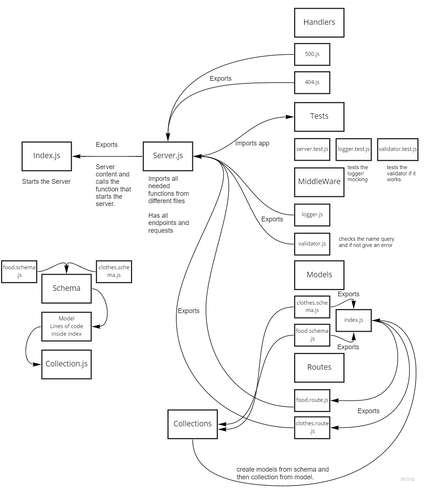

# api-server

## LAB - 04
### Deployment Test with Validator and Logger
Author: Sana Ishaqat

[tests report (actions)](https://github.com/SanaIshaqat/api-server/actions)

[back-end (heroku proof of life)](https://sana-api-server-04.herokuapp.com/alive)

[back-end (food)](https://sana-api-server-04.herokuapp.com/food)

[back-end (clothes)](https://sana-api-server-04.herokuapp.com/clothes)

[PR Link](https://github.com/SanaIshaqat/api-server/pull/1)

### Setup
.env requirements
PORT - Port Number

### Running the app
npm run dev
Endpoint: /status
Returns Object
{
  "status": "running",
  "port": 3030,
  "domain": "sanaishaqat-server-deploy-prod.herokuapp.com"
}

### Tests
Unit Tests: npm run test
Run Server: npm run dev "Runs Index.js"

UML
